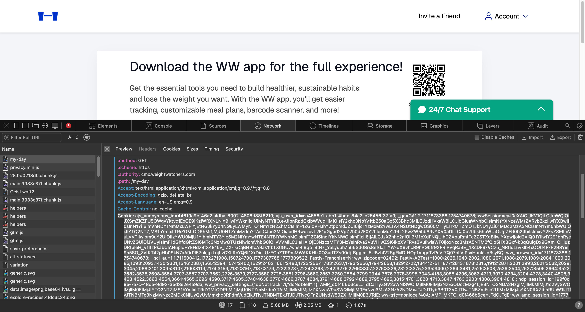

# [OPTIONAL] Authenticating with JWT

If you don't want to specify your username and password to access your Weight Watchers API data, you can alternatively authenticate using a JSON Web Token (JWT).
The weightwatchers.com website issues a JWT when you authenticate using your browser, making this an opportunity to give `wwtracked.py` temporary access by supplying the JWT with the `-J` argument, but without needing to enter your password into the `wwtracked.py` script.

> NOTE: This is optional.
> You can login to get your Weight Watchers tracking data using the `-E` argument and your email address.
> You only need to supply the JWT if you don't want to supply your password to the `wwtracked.py` script.


## Getting the JWT

The JWT is stored in the `wwSession` cookie sent with API requests in your browser. To retrieve it:

1. Navigate to [www.weightwatchers.com](https://www.weightwatchers.com) and log in
2. Open browser DevTools (right-click → Inspect, or F12)
3. Navigate to the **Network** tab
4. Refresh the page to record network requests
5. In the filter box, type `my-day` to find the WW API call that `wwtracked.py` also uses
6. Click that request and scroll to the **Request Headers** section
7. Find the `Cookie:` header — it contains many key=value pairs separated by `;`
8. Locate `wwSession=` within the cookie string and copy everything after `wwSession=` up to the next `;`

The value you copy is the JWT. It begins with `eyJ` and is approximately 900+ characters long.



For example, the `Cookie:` header will look something like:

```text
Cookie: ajs_anonymous_id=...; wwSession=eyJ0eXAiOiJKV1Q...vwoQ; ww_browser_id=...
```

Copy only the `wwSession` value — `eyJ0eXAiOiJKV1Q...vwoQ` — not the surrounding cookie names or semicolons.

> NOTE: The JWT expires after approximately 2 hours. You will need to retrieve a fresh token each session.


## Using the JWT

You can specify the JWT on the command line using `-J`:

```text
$ python3 wwtracked.py -s 2022-12-20 -e 2022-12-30 -J "eyJ0eX...zqdVwoQ"
```
